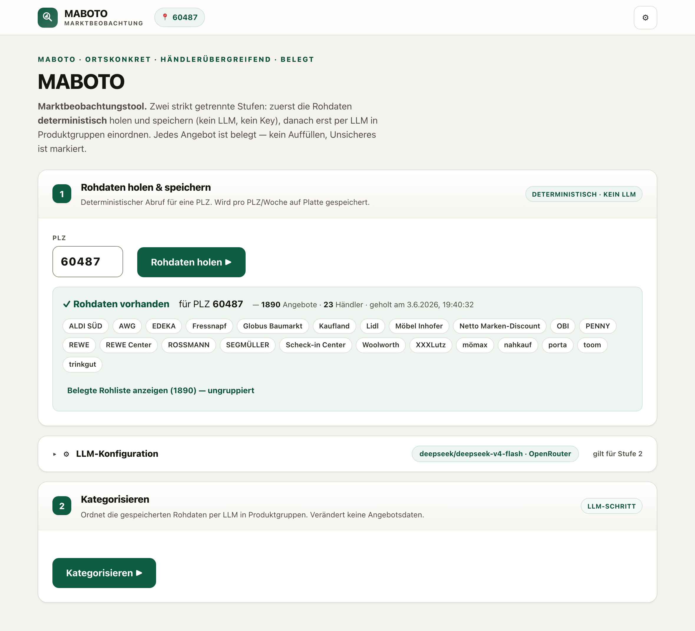
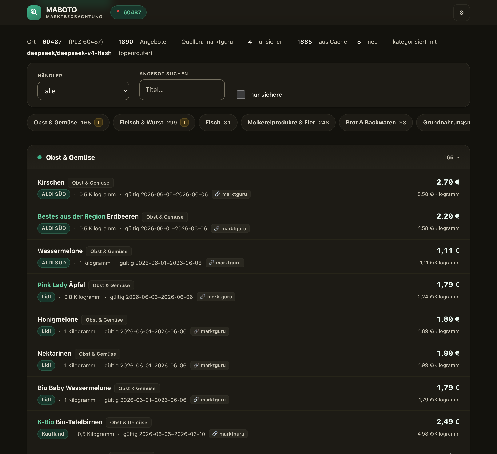

# MABOTO — Marktbeobachtungstool

[](https://github.com/Jeuners/timopro/actions/workflows/tests.yml)

Ortskonkrete, händlerübergreifende Übersicht wöchentlicher Supermarkt-Angebote,
geordnet nach Produktgruppen. Neutral, nicht als Hochglanzprospekt.

**Live-Demo:** <https://dev.dillenberg.net/angebote/>

---

## Worum es hier eigentlich geht

Dieses Repo ist mehr als ein Angebots-Tool. Es ist eine **Referenz dafür, wie
man KI *richtig* einsetzt** -- nicht, indem man die ganze Aufgabe einem Modell
übergibt, sondern indem man genau trennt, was deterministisch gehört und was
nur ein LLM kann. Wer die fünf Punkte unten versteht, hat das Wesentliche.

### 1. Der Schnitt: Vor KI muss man erst KI einsparen

Die Aufgabe *sieht* nach einer KI-Aufgabe aus. Sie ist es nur zur Hälfte. Sie
zerfällt in zwei strikt getrennte Teile:

| Teil | Wesen | Werkzeug |
|---|---|---|
| **Daten holen** (Preise, Gültigkeiten, Händler an Ort X) | reproduzierbar, exakt | **kein LLM** -- HTTP + Parser |
| **Kategorisieren** (ist Toffifee Süßware? gehört eine Blühpflanze in eine Lebensmittelliste?) | echte Ambiguität | **LLM** -- und nur hier |

> Wer alles dem Modell gibt, bekommt erfundene Preise. Wer alles deterministisch
> löst, scheitert an der Einordnung. Richtig ist die Arbeitsteilung.

Im Code ist dieser Schnitt nicht verhandelbar: Der Fetch-Teil enthält **keinen
einzigen LLM-Aufruf** -- ein Test (`tests/`) prüft genau das.

### 2. Architektur statt Präferenz: Qualität als prüfbare Bedingung

Eine Regel, die nur als höfliche Bitte im Prompt steht („möglichst keine
erfundenen Preise"), bricht unter Druck still weg. Eine Regel, die als
**prüfbare Bedingung im Datenfluss** steht, hält. Drei solcher Regeln sind hier
festverdrahtet -- und durch Tests abgesichert:

- **Kein Auffüllen.** Keine belegten Angebote für eine Gruppe → „keine Daten",
  niemals ein plausibel klingendes erfundenes Beispiel.
- **Nur Belegtes.** Preis, Gültigkeit, Händler stammen aus dem Datensatz, nicht
  aus dem Modell. Fehlendes Feld = als fehlend markiert, nicht geraten.
- **Abbruch statt stiller Drift.** Gibt die Datenlage die Anforderung nicht her
  (kein Treffer für den Ort), bricht das Programm mit klarer Ursache + Vorschlag
  ab -- statt ein „irgendwie vollständig aussehendes" Ergebnis zu liefern.

Deshalb „sagt das System, wenn es scheitert" -- nicht aus Einsicht des Modells,
sondern weil eine externe Bedingung es erzwingt.

### 3. Der Cache macht ein Mini-Model möglich

Jedes vom LLM (oder per Hand) eingeordnete Produkt landet in einem schnellen
SQLite-Cache (`titel+marke → gruppe`, modell-agnostischer Schlüssel). Beim
nächsten Lauf überspringen bekannte Produkte das LLM komplett. In der Praxis
sinkt die LLM-Last über die Wochen drastisch -- bis ein kleines, billiges
Modell (oder gar keins) für die wenigen Neuzugänge reicht. **KI sparsam machen,
indem man sie ihre eigene Arbeit zwischenspeichern lässt.**

### 4. Ehrlich über Grenzen

- Lokale Modelle (3-9 B über Ollama) liefern für diese Batch-Tool-Calling-Aufgabe
  oft *kein* zuverlässiges Ergebnis. Das System rät dann nicht -- es markiert
  alles als „Sonstiges/unsicher". Der Mangel ist sichtbar, nicht kaschiert.
- Discounter-Abdeckung wird **datengetrieben** ausgewiesen (beobachtete Händler),
  nicht behauptet. Die pauschale Annahme „Aldi/Lidl fehlen bei Aggregatoren"
  wurde von den echten Daten widerlegt -- also steht sie auch nicht im Code.

### 5. Mensch im Loop + sichtbare KI-Arbeit

- Unsichere (oder falsch eingeordnete) Angebote sind per Klick korrigierbar; die
  Korrektur fließt als **stärkstes Cache-Signal** (`modell="manuell"`) zurück --
  das Produkt ist danach nie wieder unsicher.
- Jede LLM-Aktion zeigt **sichtbar Aktivität** (animierter Indikator, Fortschritt,
  Modellname, Button-Ladezustand). Das ist als Grundregel in `CLAUDE.md`
  verankert: deterministische Schritte dürfen still laufen, LLM-Schritte nicht.

---

## So sieht es aus

Zweistufige UI -- Rohdaten holen (deterministisch), dann kategorisieren (LLM).
Heller Modus (Start-Screen):



Die nach Produktgruppen gruppierte Ergebnisansicht nach Stufe 2 -- hier im
Dunkelmodus (die UI folgt automatisch dem System-Theme):



**Barrierefrei & adaptiv.** Hell/Dunkel adaptiv (`prefers-color-scheme`),
volle Tastaturbedienung mit sichtbarem Fokus, `aria-live` für den
LLM-Fortschritt. Die Farbpaletten beider Themes sind auf **WCAG-AAA-Kontrast
(≥7:1)** ausgelegt -- automatisiert mit `axe-core` geprüft: 0 Verletzungen,
inklusive der verschärften AAA-Regel `color-contrast-enhanced`.

---

## Die Datenquelle (ehrlich)

Der erste echte Adapter spricht die öffentliche Angebots-API von **marktguru**
an. Das ist ein **Bildungs-/Recherche-Projekt**, kein Produkt: Der Abruf
respektiert `robots.txt`, drosselt sich und bricht bei fehlender Erlaubnis
sauber ab (Regel 4), statt blind weiterzulaufen. Die Quellen-Schicht ist hinter
einer Adapter-Schnittstelle (`quellen/basis.py`) gekapselt -- ein anderer
Anbieter mit ausdrücklicher API-Erlaubnis lässt sich ohne Eingriff in den Rest
ergänzen. Wer das Projekt produktiv nutzen will, klärt die Nutzungsbedingungen
der jeweiligen Quelle selbst.

---

## Setup

```bash
python3 -m venv .venv && source .venv/bin/activate
pip install -r requirements.txt
```

## Nutzung (CLI)

```bash
# PLZ direkt (immer verlässlich):
python -m angebote 60487

# Ortsname (nur für die in config.py hinterlegte Auswahl großer Städte;
# unbekannter Ort -> ehrlicher Abbruch mit Vorschlag, keine Notlösung):
python -m angebote "Frankfurt"

# Ohne Kategorisierung (kein LLM, flache belegte Liste):
python -m angebote 60487 --no-llm
```

Der Kategorisier-Schritt braucht einen LLM-Zugang in der Umgebung --
`OPENROUTER_API_KEY` (empfohlen, viele Modelle) **oder** `ANTHROPIC_API_KEY`.
Fehlt beides und es wird kein `--no-llm` gesetzt, bricht das Programm ehrlich
ab. Modell überschreiben mit `--modell`, Anbieter erzwingen mit
`--anbieter openrouter|anthropic`. Modelle auflisten:
`python -m angebote --modelle [suchbegriff]`.

## Web-UI

Lokale FastAPI-App -- dünne Schicht über denselben Modulen, der Schnitt bleibt
gewahrt. Sie macht den **zweistufigen Ablauf** sichtbar und erzwingt seine
Reihenfolge:

1. **Stufe 1 -- Rohdaten holen & speichern** (deterministisch, kein LLM, kein
   Key): Abruf für eine PLZ, Persistenz pro PLZ/Woche unter `data/roh/`.
2. **LLM-Konfiguration** -- Panel mit **Anbieter-Umschalter**:
   - **OpenRouter** (Cloud): Key + Modellauswahl (Liste/Suche/Aktualisieren).
     Default `deepseek/deepseek-v4-flash` -- günstig (~1-2 Cent/Lauf), verlässlich.
   - **Ollama** (lokal): zeigt die lokal installierten Modelle (kein Key, kein
     Netz) -- mit ehrlichem Hinweis zur Tool-Calling-Grenze kleiner Modelle.

   Anbieter + Modell werden gemerkt (`localStorage`) und überleben einen Reload;
   das gewählte Modell ist dauerhaft sichtbar.
3. **Stufe 2 -- Kategorisieren** (LLM): läuft **nur auf den gespeicherten
   Rohdaten** und ist gesperrt, solange keine vorliegen. Ergebnis ist die nach
   Produktgruppen gruppierte Übersicht mit Filtern, Unsicherheits-Markierung,
   Korrektur-Button und belegter Quelle je Angebot.

Starten:

```bash
pip install -r requirements.txt   # enthält fastapi + uvicorn
cd src
OPENROUTER_API_KEY=… PYTHONPATH=. uvicorn angebote.web:app --port 8077
# Browser: http://127.0.0.1:8077/
```

Die App ist als **Single-User-Werkzeug für localhost** gedacht -- nicht mit
`--host 0.0.0.0` ungeschützt ins Netz stellen (keine Auth auf den Endpoints).
Die öffentliche Demo läuft hinter einem Reverse-Proxy als Schaufenster.

## Tests

```bash
python -m pytest -q
```

Die Suite prüft **die Architektur-Regeln**, nicht nur den Happy Path:
kein Auffüllen, Abbruch bei leerem/unauflösbarem Ort, Daten-Integrität nach der
Kategorisierung, geschlossene Kategorienliste, Unsicherheits-Flag, der
Schnitt-Test „kein LLM im Fetch-Teil", Cache-Verhalten (bekannte Produkte
überspringen das LLM), die Korrektur-zu-Cache-Schleife, Modell-Discovery
(OpenRouter + Ollama), Anbieter-/Retry-Logik und die Web-Endpoints. Alles läuft
offline (Fakes); ein E2E-Test (Playwright) prüft die Konfig-Persistenz im Browser.
CI führt die volle Suite bei jedem Push aus (Badge oben).

## Entwicklung mit Claude Code

`CLAUDE.md` ist der verbindliche Leitfaden. Die beiden `SKILL.md` in
`.claude/skills/` sind die Spezifikationen der zwei Teile -- beim Arbeiten am
jeweiligen Teil zuerst die passende SKILL.md lesen, den Schnitt nie vermischen.

## Struktur

```
CLAUDE.md                                  Leitfaden / Architektur
README.md                                  dieses Dokument
requirements.txt                           Abhängigkeiten
.github/workflows/tests.yml                CI: volle Testsuite bei jedem Push
docs/                                      Screenshots für dieses Dokument
.claude/skills/angebote-fetch/             Spec: deterministischer Datenabruf
.claude/skills/angebote-kategorisieren/    Spec: LLM-gestützte Einordnung
src/angebote/                              Implementierung
  modell.py        eingefrorenes Angebot-Datenmodell
  fehler.py        AbbruchFehler (Regel 4)
  config.py        Quellenliste, Produktgruppen, Orts-Auflösung
  quellen/         ein Adapter pro Quelle (rein = Ort, raus = [Angebot])
    basis.py       Adapter-Schnittstelle + Ort
    marktguru.py   erster echter Adapter, geprüfter Ortsbezug
  fetch.py         Orchestrator (Ort rein, belegte Angebote raus)
  speicher.py      Persistenz der belegten Rohdaten (Stufe 1), kein LLM
  kategorisieren.py LLM-Schritt hinter Protokoll (OpenRouter/Anthropic), testbar
  produktcache.py  schneller SQLite-Cache (titel+marke -> gruppe), kein LLM
  modelle.py       OpenRouter-Modell-Discovery (Liste/Suche/Top-Free)
  modellauswahl.py interaktive Modellauswahl (CLI)
  uebersicht.py    Gruppierung + Rendering (Markdown + JSON-Struktur)
  web.py           FastAPI-Web-UI (Stufe-1-/Stufe-2-/Korrektur-Endpoints)
  web_static/      Frontend (index.html)
  cli.py / __main__.py  CLI-Einstieg
tests/                                     Architektur-/Cache-/Web-/E2E-Tests
data/roh/                                  generierte Rohdaten (ge-ignored)
data/kategorie_cache.sqlite                Produkt->Kategorie-Cache (ge-ignored)
```

## Lizenz

[MIT](LICENSE).
